# 大语言模型学习笔记

## 前言
- 阅读建议与知识预备
- 贡献者
- 文档架构说明

## 目录
- [大语言模型学习笔记](#大语言模型学习笔记)
  - [前言](#前言)
  - [目录](#目录)
  - [1. 大语言模型基础概念](#1-大语言模型基础概念)
    - [1.1 什么是大语言模型？](#11-什么是大语言模型)
    - [1.2 Transformer回顾](#12-transformer回顾)
    - [1.3 模型类型：Encoder-Only、Decoder-Only、Encoder-Decoder](#13-模型类型encoder-onlydecoder-onlyencoder-decoder)
    - [1.4 非Transformer架构的LLM](#14-非transformer架构的llm)
    - [1.5 参考文献与相关内容](#15-参考文献与相关内容)
  - [2. 大语言模型底层架构优化](#2-大语言模型底层架构优化)
    - [2.1 注意力机制及其变体](#21-注意力机制及其变体)
    - [2.2 位置编码与长上下文支持](#22-位置编码与长上下文支持)
    - [2.3 混合专家模型（MoE）](#23-混合专家模型moe)
    - [其他架构创新](#其他架构创新)
    - [参考文献与相关内容](#参考文献与相关内容)
  - [3. 模型预训练](#3-模型预训练)
    - [3.1 数据准备](#31-数据准备)
    - [3.2 预训练任务设计](#32-预训练任务设计)
    - [3.3 分布式训练与优化](#33-分布式训练与优化)
    - [3.4 新的预训练范式](#34-新的预训练范式)
    - [3.5 参考文献与相关内容](#35-参考文献与相关内容)
  - [4. 模型微调与知识蒸馏](#4-模型微调与知识蒸馏)
    - [4.1 监督微调（Supervised Fine-tuning, SFT）](#41-监督微调supervised-fine-tuning-sft)
    - [4.2 知识蒸馏（Knowledge Distillation）](#42-知识蒸馏knowledge-distillation)
    - [4.3 参考文献与相关内容](#43-参考文献与相关内容)
  - [5. 强化学习与深度思考能力](#5-强化学习与深度思考能力)
    - [5.1 人类反馈强化学习（RLHF）](#51-人类反馈强化学习rlhf)
    - [5.2 深度思考模型](#52-深度思考模型)
    - [5.3 群体相对策略优化（GRPO）](#53-群体相对策略优化grpo)
    - [5.4 过程奖励模型（PRM）与蒙特卡洛树搜索（MCTS）](#54-过程奖励模型prm与蒙特卡洛树搜索mcts)
    - [5.5 DAPO与VAPO](#55-dapo与vapo)
    - [5.6 生成式奖励模型](#56-生成式奖励模型)
    - [5.7 参考文献与相关内容](#57-参考文献与相关内容)
  - [6. 小模型优化与测试时扩展](#6-小模型优化与测试时扩展)
    - [6.1 模型压缩技术](#61-模型压缩技术)
    - [6.2 测试时扩展TTS](#62-测试时扩展tts)
    - [6.3 参考文献与相关内容](#63-参考文献与相关内容)
  - [7. 工程实现与优化](#7-工程实现与优化)
    - [7.1 我需要多少显存？](#71-我需要多少显存)
    - [7.2 分布式训练框架](#72-分布式训练框架)
    - [7.3 推理加速工具](#73-推理加速工具)
    - [7.4 训练与推理工具链](#74-训练与推理工具链)
    - [7.5 超参数调整](#75-超参数调整)
    - [7.6 参考文献与相关内容](#76-参考文献与相关内容)
  - [8. 多模态](#8-多模态)
    - [8.1 多模态模型概述](#81-多模态模型概述)
    - [8.2 多模态混合生成](#82-多模态混合生成)
    - [8.3 参考文献与相关内容](#83-参考文献与相关内容)
  - [9. LLM Based Agent](#9-llm-based-agent)
    - [9.1 Agent 概述](#91-agent-概述)
    - [9.2 Manus与自主智能体](#92-manus与自主智能体)
    - [9.3 DeepResearch](#93-deepresearch)
    - [9.4 MCP协议](#94-mcp协议)
    - [9.5 参考文献与相关内容](#95-参考文献与相关内容)
  - [10. LLM工程前沿速览](#10-llm工程前沿速览)
    - [10.1 OpenAI](#101-openai)
    - [10.2 DeepSeek](#102-deepseek)
    - [10.3 Qwen](#103-qwen)
    - [10.4 Anthropic](#104-anthropic)
    - [10.5 Seed](#105-seed)
    - [10.6 Meta](#106-meta)
    - [10.7 ERNIE](#107-ernie)
    - [10.8 其他前沿模型](#108-其他前沿模型)
  - [附录](#附录)
    - [术语表（Glossary）](#术语表glossary)
    - [致谢与贡献指南（CONTRIBUTING.md）](#致谢与贡献指南contributingmd)

## 1. 大语言模型基础概念
### 1.1 什么是大语言模型？
### 1.2 Transformer回顾
### 1.3 模型类型：Encoder-Only、Decoder-Only、Encoder-Decoder
### 1.4 非Transformer架构的LLM
### 1.5 参考文献与相关内容

## 2. 大语言模型底层架构优化
### 2.1 注意力机制及其变体
    - Multi-head Attention (MHA)
    - Multi-Query Attention (MQA) （word中没见）
    - Grouped Query Attention (GQA) （word中没见）
    - Flash Attention 及其性能优势 （word中没见）
    - 多头潜在注意力（MLA）
    - 原生稀疏注意力（NSA）

多头潜在注意力 (Multi-Head Latent Attention, MLA) 针对标准 Transformer 中多头注意力 (Multi-Head Attention, MHA) 在推理阶段需要存储大量 K/V 缓存（KV Cache）的问题，提出一种低秩的联合压缩机制，对 K、V（以及可选的 Q）进行低维潜在表示压缩，从而在几乎不损失性能的情况下显著减少显存占用并提升推理效率。

> 注：此处“推理”(inference) 指训练完成后模型执行前向计算生成输出的过程，与模型进行思考、分析时的“推理”(reasoning) 概念不同。文献中通常不做特别区分，需结合上下文理解。

##### 1. 标准 MHA 的局限
图 2.1.1（左）展示了典型的 Transformer 结构（Encoder + Decoder）。DeepSeek 系列属于 Decoder-Only 结构，由多层堆叠的 Transformer Decoder 组成。多头注意力（MHA）是捕捉输入序列不同特征的核心机制，如图 2.1.2（右）所示。

表格并排示意：

| Transformer 结构示意 | 多头注意力结构示意 |
| ---------------------- | ------------------ |
| 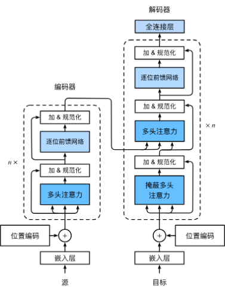 | 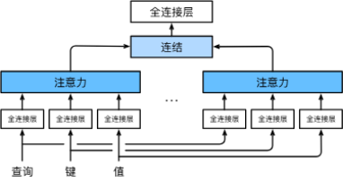 |

##### 2. 标准 MHA 的计算流程
（1）通过线性映射得到查询 Q、键 K、值 V：

（2）将 Q、K、V 按头数进行切分并并行计算：

（3）按注意力权重（softmax 归一化后）进行加权求和：
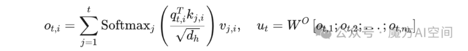

在实际推理中，每个注意力头都需要维护对应的 K、V（以及当前 Token 的 Q 参与计算），因此 KV Cache 的显存开销随：层数 × 头数 × 序列长度 × 每头维度 线性增长。当上下文长度较长时（例如 >10K tokens），KV Cache 可能成为显存主要占用来源。例如：实测在 24GB 显存（RTX 3090）上运行 Qwen2.5-32B（4bit 量化）时，若上下文长度超过约 10,240，会发生显存溢出。

##### 3. 典型的 KV 压缩/共享策略
- MQA (Multi-Query Attention)：所有注意力头共享同一组 K、V。
- GQA (Grouped Query Attention)：将若干 Query 头分组，每组共享一对 K、V。
- MLA：通过低秩潜在空间对 K、V（可扩展到 Q）进行联合压缩，减少缓存尺寸。

这些方案在保持模型表达能力与推理吞吐之间做权衡。MLA 的核心改进点在于：不是简单地“共享” K、V，而是映射到更紧凑的潜在表示，再通过轻量重建或投影参与注意力计算，以进一步减少显存占用。

##### 4. MLA 的优势概述
1. 更小的 KV Cache：低秩潜在表示显著减小缓存尺寸。
2. 更高的推理吞吐：更少的内存读写与带宽压力。
3. 易与其他优化结合：可叠加 Flash Attention、量化、稀疏注意力等。
4. 兼顾精度：相比直接降维或激进共享策略（极端 MQA），对模型性能影响更可控。

##### 5. 多种注意力/压缩方式对比
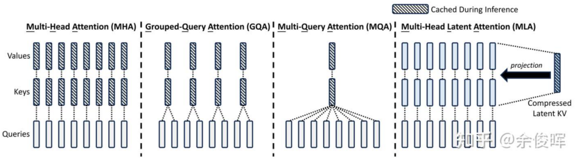

##### 6. 进一步说明（KV Cache 与显存）
在推理阶段，显存主要由三部分组成：
1. 模型参数（静态，占用相对固定，量化可降低其比例）；
2. 前向激活（可用层级重计算、张量并行、流水线并行等方式优化）；
3. KV Cache（与层数、上下文长度成正比，是长上下文推理的瓶颈）。

因此，围绕 KV Cache 的结构性优化（MQA / GQA / MLA）成为主流大模型推理加速的重要方向之一。MLA 提供了一种更“结构化”的压缩方式，而不是仅仅通过共享来减少冗余。

> 小结：MLA 通过“低秩潜在表示 + 联合压缩”显著降低推理内存带宽和缓存需求，为更长上下文与更高吞吐奠定基础，是 DeepSeek 系列在注意力机制上的关键创新之一。

#### 原生稀疏注意力（Native Sparse Attention, NSA）

在 MLA 之后，DeepSeek 最新论文又公开了新的注意力压缩 / 加速方式：原生稀疏注意力 NSA（Native Sparse Attention），代表了该方向的最新探索，并可能在下一代模型中采用。NSA 旨在在极长上下文（例如 64K 乃至更长）下兼顾：
1. 全局上下文感知（不完全丢失远距依赖）
2. 局部精细建模（保持关键 token 的精度）
3. 计算/显存友好（注意力复杂度与内存访问大幅下降）

其核心是“动态分层稀疏策略”：结合（A）粗粒度 token 压缩 与（B）细粒度 token 选择，并引入（C）局部滑动窗口，三路并行，最后门控融合。论文指出 NSA 的关键创新：
- 通过算术强度（Arithmetic Intensity）与内存访问平衡的算法设计实现显著加速，并针对现代 GPU 进行了核函数优化；
- 支持端到端预训练（即注意力稀疏性是原生架构特征，而非后处理裁剪），从而减少预训练 FLOPs 而不牺牲性能。

“原生”强调：模型在预训练阶段即使用稀疏注意力拓扑，而不是训练完再做稀疏化（那样往往需要先算全量注意力分数再做阈值筛选，既没真正省算力，还会损伤效果）。NSA 的重点是结构性地提前定义并学习：哪些 K、V 需要被关注，哪些可以被压缩或跳过。

##### 1. 两个推理阶段与优化侧重点
一个典型推理型 LLM 的使用流程可分为：处理 Prompt、生成长 CoT（Chain of Thought）、生成最终回答。对应底层是两个阶段：
1. 预填充（Pre-Filling）：对输入上下文进行一次性前向，填充每层 KV Cache（高度并行，延迟相对低）；
2. 解码（Decoding）：逐步（或多 Token 批量，若使用 MTP）生成输出，串行依赖严重，延迟瓶颈明显。

如下图 2.1.7 所示：
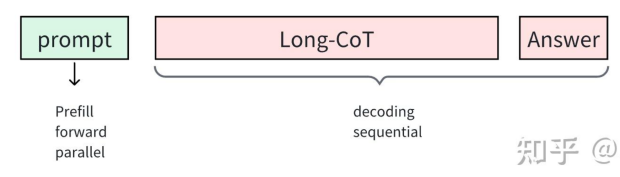

MLA 与 NSA 的关系：
- MLA 主要减小 KV Cache（利好预填充可并行阶段的显存/吞吐、多会话并发能力）；
- NSA 面向解码阶段的时间复杂度与延迟瓶颈，通过稀疏结构减少每一步的注意力计算开销；
- 二者是互补关系，不是替换关系，可联合使用：预填充用 MLA 压缩 KV，解码用 NSA 稀疏注意力。

##### 2. NSA 的三路分层结构
NSA 将输入序列按时间（位置）划分为连续 Block（块），并使用三条并行注意力分支：
- 压缩注意力（Compressed Attention）：将一段序列压成一个代表全局/片段摘要的向量（每头或部分头关注不同片段）；
- 选择性注意力（Selected Attention）：从更大范围中选出“重要”的细粒度 token（稀疏挑选 Top-K 或基于可学习打分机制）；
- 滑动窗口注意力（Sliding Attention）：覆盖最近的局部上下文，保证短期依赖与语义连续。

三种输出经过门控融合（含 MLP + Sigmoid 门）得到最终表示。结构示意：
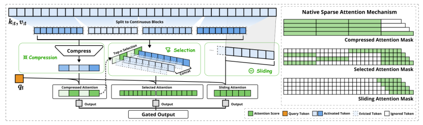

下图给出来自网络资料的直观讲解：
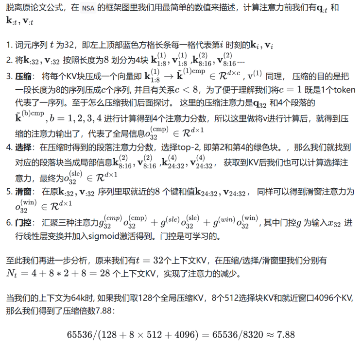

##### 3. 压缩注意力（Compressed Attention）
思想：将一个 Block 内的 K、V 聚合（例如通过可学习 MLP、加权池化、低秩投影等）得到一个紧凑向量 (K_c, V_c)，供所有查询访问，提供粗粒度全局信息。位置 t 的 token 与相关压缩块交互，其注意力形式示意：
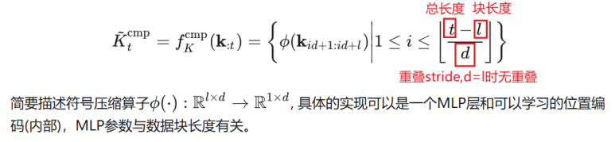

得到各头、各片段的注意力得分后（如下）：
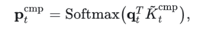

##### 4. 选择性注意力（Selected Attention）
针对仅用压缩会损失细粒度语义的问题，引入选择模块：对块内（或跨块）token 打分，选出最重要子集参与精细注意力计算，示意：
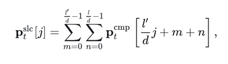

当压缩块与选择块共享同一分块方案（l'=l=d）时，可写出对应的注意力得分形式：
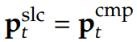

对多头（H 个头）的扩展：
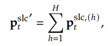

整体交互参考下图：
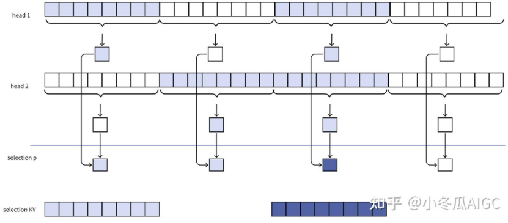

##### 5. 滑动窗口注意力（Sliding Attention）
只对最近若干 Block / Token 进行全连接注意力，保证短期上下文精细建模：
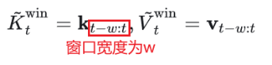

##### 6. 门控融合与核函数优化
三路注意力输出通过门控（一个小型 MLP + Sigmoid）进行自适应加权融合，得到最终上下文表示。实现中，为高效利用 GPU：
- 设计 Grid Loop：先批量加载 Q，逐元素/逐头迭代 NSA；
- 设计 Inner Loop：再按需加载 KV；随 t 增大，由于每步仅固定少量（例如 3 块）KV 参与，NSA 加速优势愈明显。

图 2.1.17：门控融合与整体输出（示意）

性能导向的内核示意：
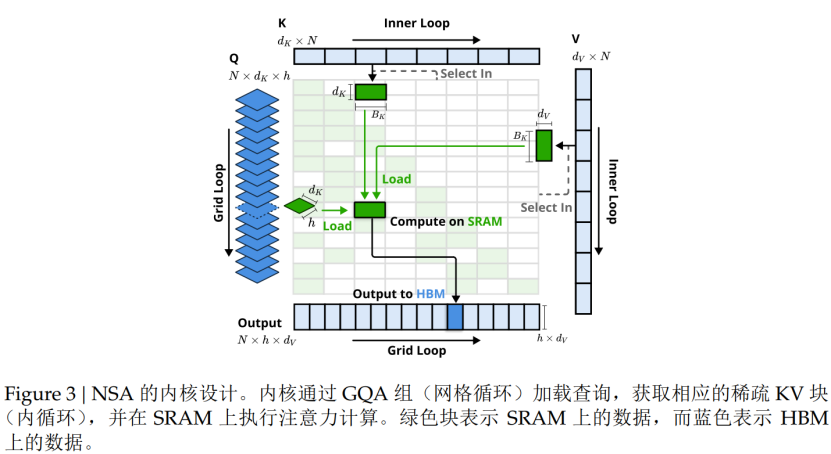

##### 7. 与其他稀疏方案的比较与扩展
NSA 不是随机/固定模式稀疏，而是结构性 + 动态（选择分支可学习），兼顾：
- 全局覆盖（压缩分支）
- 重要性保留（选择分支）
- 局部连续（滑动窗口）
结合 MQA / GQA 可进一步减少 K/V 物理存储与带宽占用。

##### 8. 相关的并行探索：MOBA
Kimi 发布的 MOBA（Mixture of Block Attention for Long-Context LLMs）同样将序列分块，允许每个查询 token 动态选择最相关的块，提升长上下文效率。本文不展开，读者可参考其论文：
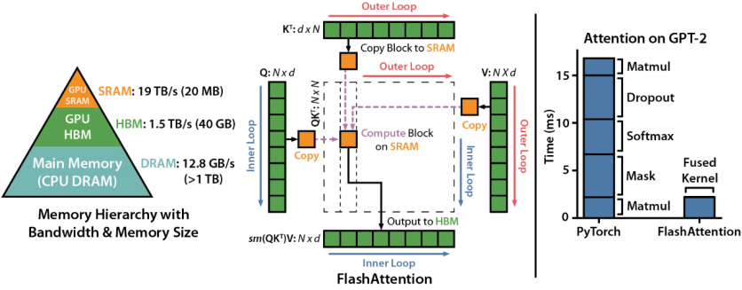

##### 9. 小结（MLA vs NSA vs 组合）
| 目标 | MLA | NSA | 组合价值 |
| ---- | --- | --- | -------- |
| 主要阶段 | 预填充（KV 构建） | 解码（逐步生成） | 覆盖端到端推理 |
| 核心手段 | 低秩联合压缩 K/V | 分层稀疏（压缩+选择+窗口） | 既减缓存又降计算 |
| 复杂度影响 | 降低缓存尺寸 / 内存带宽 | 降低每步注意力 FLOPs | 双重加速 |
| 精度策略 | 保留信息再投影 | 重要性筛选 + 摘要 | 互补，损失更小 |

> 结论：MLA 与 NSA 面向推理不同瓶颈（显存 vs 延迟），具备组合空间。未来 DeepSeek 可能采用“MLA + NSA + Flash Attention / 量化”等多技术叠加形成系统级优化。

### 2.2 位置编码与长上下文支持
    - RoPE（旋转位置编码）
    - YaRN、ALiBi 等扩展方法（word没见）
    - 超长上下文处理策略

#### 旋转位置编码（RoPE）与 MLA 的协同改进

当前主流大模型（LLaMA 系 / Qwen / DeepSeek 等）的位置编码采用 RoPE（Rotary Positional Encoding，旋转位置编码）。RoPE 的核心：通过在二维子空间内施加基于绝对位置的旋转，将绝对与相对位置信息同时隐式注入自注意力点积中，从而获得：
1. 更好的长度外推性（Extrapolation）
2. 平滑的远距离衰减特性（注意力随距离自然减弱）
3. 与多头注意力 / 线性注意力兼容的形式

问题：RoPE 编码作用在 Q、K 的位置相关维度上；而 MLA 中对 K、V 做了低秩潜在压缩，得到的潜在表示本身是“位置无关”的，如果直接用作注意力，可能丢失必要的位置信息。

DeepSeek 的工程解决方式：
- 给 Q、K 增加一小段专门用于 RoPE 的附加维度；
- K 的这部分附加维度在所有头之间共享（例如增加 64 维），与潜在空间的 512 维相比占比不高；
- 非 RoPE 部分仍然复用 MLA 的压缩结果，推理阶段 KV Cache 只需存一次潜在 K/V + 一份共享的 RoPE 位置相关维度；
- 这样兼顾：显存节省（MLA 优势）+ 位置信息保留（RoPE 兼容）。

#### 什么是 RoPE？
将高维向量分解为若干二维子空间（(x_{2i}, x_{2i+1}) 对），对每个子空间施加与位置 m 相关的旋转：
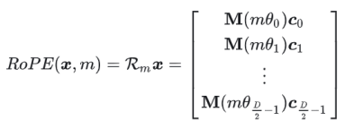

设向量维度为 D，频率序列 θ_i 由超参数（如 b=10000）控制：较低维度对应较慢频率（较平缓旋转），高维度对应较快频率（更快相位变化），从而编码多尺度位置信息。这样：
- 若两个 token 位置接近，其旋转角度差小，点积保持较高；
- 若位置差大，旋转后相位差大，点积自然减弱，实现平滑的距离衰减。

原论文中的直观展示如下：
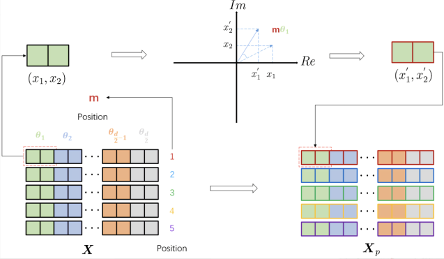

> RoPE 的一个扩展方向是：通过缩放或插值方式（如 YaRN、NTK-aware、Dynamic NTK、iRoPE 等）增强超长上下文下的稳定性。它们核心思想多集中在“频率映射重参数化 + 长度外推时的频率压缩或混合策略”。

#### 小结（RoPE 与 MLA）
- MLA 进行结构压缩 → 位置被淡化
- 补充共享 RoPE 维度 → 恢复必要位置信息
- 共享 + 小维度策略 → 几乎不显著增加 KV Cache 体积

#### 超长上下文处理策略补充
2025 年 4 月 6 日发布的 Llama 4 Scout（109B MoE）声称实现了 10M tokens 的超长上下文能力，其基础是提出的 iRoPE 架构。其特点：
1. 使用“无位置嵌入”的交错注意层（Interleaved Layers），减少位置信息重复建模负担；
2. 在推理阶段对注意力进行“温度缩放”（Attention Temperature Scaling），提升长度泛化的稳定性；
3. iRoPE 可能在频率分布或分层旋转机制上采用改进，使得在极长序列上相位累积的数值漂移更可控。

由于具体细节仍在陆续公开阶段，当前可关注：
- 频率重新参数化（Re-parameterization）
- 分段/层次频率混合（Hierarchical / Segmented Frequencies）
- 与稀疏或分块注意力结合（例如与 NSA 类似结构）

> 方向趋势：位置编码从“固定函数”走向“结构 + 动态 + 插值可控”体系，以匹配 1M~10M 级上下文需求。

    
### 2.3 混合专家模型（MoE）
    - MoE 基本原理
    - DeepSeek MoE 实现
    - 负载均衡策略
    
#### MoE 基本原理
在图 2.1.1（左）的 Transformer 结构中，每层包含前馈网络（FFN），通常由两层线性层 + 激活函数（如 ReLU / SwiGLU 等）组成。在 MoE（Mixture of Experts） 架构中，一部分（或全部）FFN 层被“稀疏 MoE 层 + 门控网络（Router / Gate）”替换，使得每个 Token 前向传播时只激活少量“专家”(Experts)，实现“计算稀疏 + 参数规模扩展”。

MoE 的核心组成（图 2.3.1）：
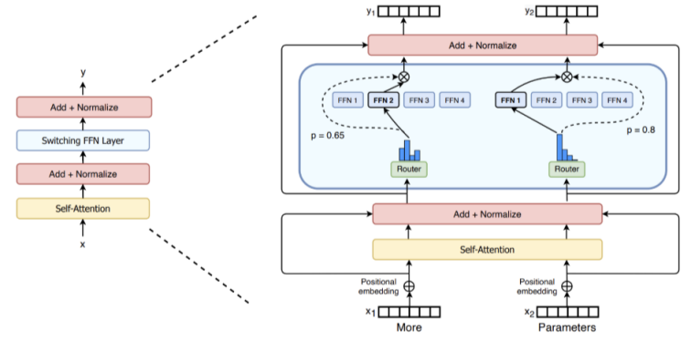

##### 1. 稀疏 MoE 层
稀疏 MoE 层取代原 FFN。它包含若干专家（Expert），每个专家通常是结构相同、参数独立的一组 FFN（当然也可以是更复杂子网络）。在训练或推理中，输入 Token 表示通过门控网络选择 Top-K 个专家进行独立前向，然后按门控权重加权求和输出。
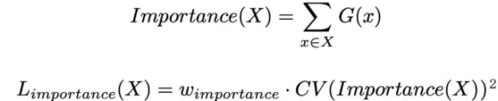

“稀疏”含义：并非所有专家都会对每个 Token 参与计算；只有被选中的少量专家会被激活。与稠密模型相比，参数总量可以大幅增加，但单次前向的计算/激活参数量保持可控。

##### 2. 门控网络 / 路由器（Router / GateNet）
门控网络接收 Token 的隐藏表示 h_t，产生一组“亲和度得分”或“重要性分数”，再通过 softmax（或变体，如 sigmoid 归一化）形成专家权重分布。常见做法：
1. 计算 score_i = W_g h_t
2. 取 Top-K（例如 K=2）专家索引 {i_1, i_2}
3. 对其对应分数做归一化得到权重 g_{i_1}, g_{i_2}
4. 输出：Σ g_{i_j} Expert_{i_j}(h_t)

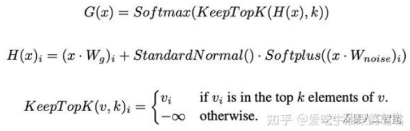

> 注：MoE 的“门控”与 RNN（如 LSTM/GRU）中的“门”不同：后者调节信息流保留比例；前者做“离散路由 / 专家选择”。

#### DeepSeek MoE 实现
DeepSeek MoE 通过“细粒度专家分割（Fine-grained Expert Splitting）”与“共享专家隔离（Shared Expert Isolation）”来提升专家专业化并减少冗余。文中提到：在 DeepSeek-R1 671B 参数规模的配置中，每次仅激活约 37B 参数。

为什么“只激活 37B”不等价于“用一个 37B 稠密模型”？
- 专家“专业化”是 token 级分布，而不是高层任务标签（不是“这个专家只做数学”那种）；
- 不同对话 / 序列中的不同 token 会触发不同专家集合；
- 整体对大量 token 的覆盖最终仍会使用绝大多数专家参数，提升“有效容量”。

推理优势：
- 单 token 前向只计算少量专家 → 单步计算 FLOPs 较低，可提升并发吞吐；
- 通过“专家并行”（Expert Parallelism）可将不同专家分布到不同设备，提升硬件利用率；
- 可在保持相同推理计算的情况下，通过增加专家数扩展总参数量（提升表达能力）。

架构示意（图 2.3.4）：
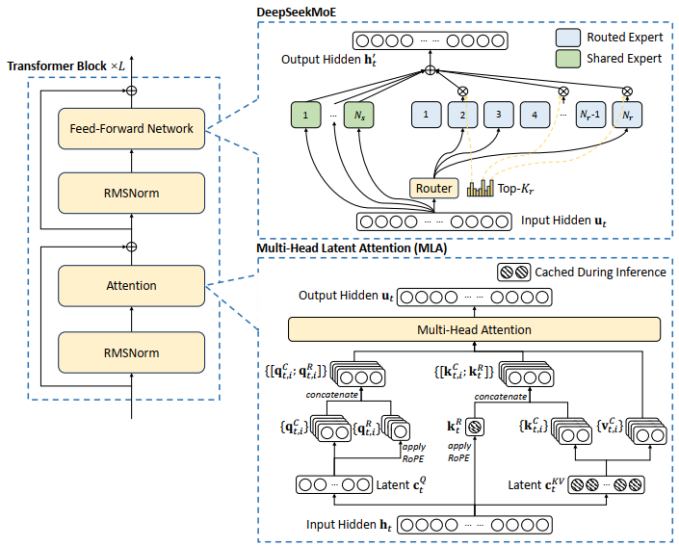

##### 1. 细粒度专家分割（Fine-grained Splitting）
将每个原始 FFN 的中间隐藏维度缩小到原来的 1/m，并切分成 m 个更小专家，同时增加每次激活的专家数量（乘以 m），维持整体计算成本近似不变。这样：
- 单个专家更“专一”，梯度更新集中；
- 提升路由的判别性（更多候选专家，粒度更细）。

##### 2. 共享专家隔离（Shared Expert Isolation）
为减少不同路由专家间的“重复学习”（公共知识冗余），隔离 K_s 个“共享专家”，所有 token 都会确定性通过这些共享专家；其余 token 由路由专家（Routing Experts）Top-K 选择。为保持总体计算不变，需要减少路由专家的激活数量 K → K - K_s。结构示意（图 2.3.5）：
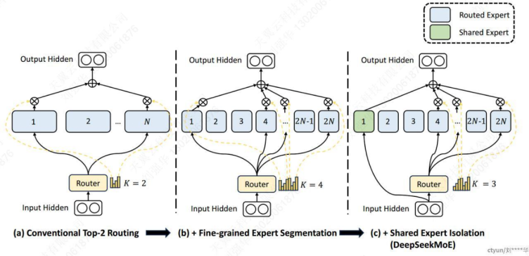

##### 3. MoE 层公式
文中给出的（简化）MoE 层输出形式：
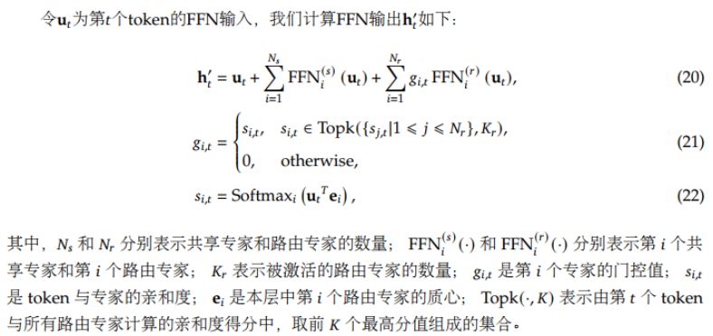

在 DeepSeek-V3 中：
- softmax 改为 sigmoid + 归一化方式生成门控值 g_{i,t}；
- DeepSeek V3 / R1：共 256 个路由专家 + 1 个共享专家；
- Llama 4 Maverick（400B）配置：128 个路由专家 + 1 个共享专家（供对比参考）。

#### 负载均衡策略（Load Balancing）
训练稀疏 MoE 的关键挑战之一：若大多数 token 被集中路由到少数专家，部分专家过载而部分闲置，会导致训练低效甚至失稳。为此引入多级负载均衡：

1. 传统做法：辅助损失（Auxiliary Loss）惩罚路由分布熵过低或专家实际使用频率偏离均匀分布。
2. DeepSeek-V2：提出“设备限制路由机制”（先选专家所在设备，再在设备内 Top-K），并设计三类辅助损失：
  - 专家级负载平衡
  - 设备级负载平衡
  - 通信平衡（减少跨设备交换）
3. DeepSeek-V3：提出“无辅助损失（Loss-free）的负载均衡”策略：
  - 为每个专家引入一个可调整偏置 b_i；
  - 路由打分：s'_{i,t} = s_{i,t} + b_i；
  - Top-K 选择基于 s'；
  - 每个 step 后：若专家过载 → 减小 b_i；若不足 → 增大 b_i；
  - 更新幅度 γ：偏置更新速度（超参数）；
  - 门控权重仍仅由原始亲和度得分（或归一化后得分）产生。

偏置调节示意（图 2.3.7）：
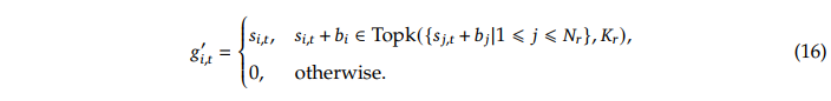

此外，为防止单序列内部极端不平衡，仍引入轻量级“序列级平衡损失”作为辅助。通过上述策略，V3 在训练与推理中几乎不需要丢弃 Token（避免“溢出丢弃”带来的梯度偏差）。

#### MoE vs Multi-Agent 对比
MoE 看起来像“多智能体协同”，但本质不同：
| 维度 | 混合专家模型 MoE | 多智能体 Multi-Agent |
| ---- | ---------------- | -------------------- |
| 架构层级 | 模型内部结构（层内专家） | 系统级（多个独立模型/服务） |
| 参数共享 | 专家部分共享主干 / 嵌入 | 一般不共享，各自独立 |
| 协作机制 | 门控网络路由，隐式协作 | 显式通信 / 协议交互 |
| 通信开销 | 低（同一模型内张量调度） | 高（RPC / 消息传递） |
| 分工粒度 | 细：token / 局部特征级 | 粗：任务/阶段/角色级 |
| 自主性 | 专家被动响应路由 | 智能体主动规划与决策 |
| 训练方式 | 端到端联合优化（共享目标） | 可独立训练 + 协作调度/强化学习 |
| 计算效率 | 稀疏激活，FLOPs 与激活参数可控 | 可能并行运行多个完整模型 |

> 小结：MoE 关注“在单一大模型内部用稀疏激活扩展容量”，Multi-Agent 关注“跨多个独立模型的任务级协作”。

### 其他架构创新
    - 多Token预测（MTP）

#### 多 Token 预测（Multi-Token Prediction, MTP）
目前主流大模型采用“下一个 Token 预测”（Next Token Prediction, NTP）作为训练目标。虽然该范式简单有效，但存在三个典型问题：
1. 效率低：与人类儿童语言习得相比，纯 NTP 需要大量数据迭代才能达到类似流利度；
2. 局部性偏好：更易学习短程 / 局部模式，对长距离依赖与全局结构（复杂推理、策略规划）捕捉不足；
3. 推理速度慢：自回归生成需逐 Token 前向，长输出时延迟显著。

DeepSeek-V3 引入 MTP：在每个位置预测多个未来 Token，提升“训练信号密度”，同时为未来的“加速式并行解码 / 批量生成”奠定基础。其总体结构如图 2.3.8：
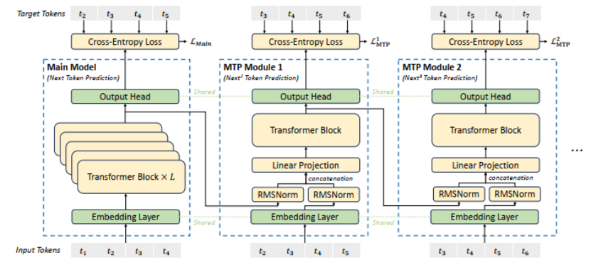

##### 1. 模块化结构
使用 D 个顺序堆叠的 MTP 模块来预测 D 个“额外未来 Token”。第 k 个 MTP 模块包含：
- 共享嵌入层 Emb
- 共享输出头 OutHead（词表投影）
- 一个 Transformer 块 TRM_k
- 一个投影矩阵 M_k ∈ R^{d × 2d}

##### 2. 输入组合与表示传递
对第 i 个输入 Token t_i 的第 k 个预测深度（k = 1..D）：
首先将该 Token 在第 (k-1) 深度的表示与第 (i + k) 个 Token 的嵌入进行拼接 / 线性组合，经投影得到当前深度输入：

该组合向量作为第 k 层 Transformer 块 TRM_k 的输入，输出更新后的表示：

式中 T 表示序列长度，i:j 表示切片（含边界）。

##### 3. 多深度共享输出头
第 k 层输出再通过共享的输出头（词表大小 V）得到第 k 个预测深度的概率分布：
P_k(t_{i+k} | context) = Softmax(OutHead(h_i^{(k)}))

##### 4. 损失函数（分深度多目标交叉熵）
对每个预测深度 k，使用真实 Token 与预测概率计算交叉熵损失：

聚合所有深度的损失，取平均并乘以权重 λ 得到总体 MTP 损失 L_MTP：

##### 5. 训练 / 推理效益分析
- 更密集监督：单次前向为多个未来位置提供梯度 → 加速学习全局依赖；
- 减少“暴露偏差”累积：多步预测逼近局部 rollout，有助于模型适应生成阶段分布；
- 推理潜力：可与 speculative decoding / 批量并行探索结合，提高 token/s；
- 与 MLA / NSA 兼容：前者节省 KV，后者加速注意力，MTP 提升训练信号 → 体系级协同。

##### 6. 与传统 NTP 的区别
| 维度 | NTP | MTP |
| ---- | --- | --- |
| 目标形式 | 仅下一 Token | 多个未来 Token (k=1..D) |
| 信号密度 | 稀疏（1/T） | 提升（D/T） |
| 长程依赖 | 间接建模 | 更直接（多步条件预测） |
| 推理延迟 | 串行 | 可探索批量 / 并行解码 |
| 优化难度 | 简单稳定 | 需调节 λ、深度 D、防止梯度冲突 |

> 备注：D 过大会引入“梯度噪声 + 模型困惑度上升”风险；实际工程中常取一个中等深度以平衡训练收益与稳定性。

##### 7. 小结
MTP 通过“多步条件预测”增强模型对未来上下文结构的前瞻建模能力，与注意力压缩（MLA）、稀疏加速（NSA）构成互补：
1. MLA：减缓存 / 增并发
2. NSA：减解码注意力成本
3. MTP：增监督信号 / 赋能并行生成潜力

共同目标：以更低的推理 / 训练成本实现更强的推理与语言生成能力。

    
### 参考文献与相关内容

## 3. 模型预训练
### 3.1 数据准备
    - 数据来源与清洗
    - Tokenizer 训练与词表构建
    - 上下文拼接策略
### 3.2 预训练任务设计
    - Causal Language Modeling（CLM）
    - Masked Language Modeling（MLM）
    - Prefix LM
    - Sequence-to-Sequence LM
### 3.3 分布式训练与优化
    - ZeRO（DeepSpeed）、Tensor Parallelism（Megatron-LM）
    - 混合并行策略
    - 梯度检查点（Gradient Checkpointing）
### 3.4 新的预训练范式
    - 强化学习预训练
### 3.5 参考文献与相关内容

## 4. 模型微调与知识蒸馏
### 4.1 监督微调（Supervised Fine-tuning, SFT）
    - 全参数微调
    - 参数高效微调PEFT
### 4.2 知识蒸馏（Knowledge Distillation）
    - 蒸馏的基本思想
    - 软标签 vs 硬标签
    - DeepSeek-R1 的蒸馏策略
### 4.3 参考文献与相关内容

## 5. 强化学习与深度思考能力
### 5.1 人类反馈强化学习（RLHF）
    - RL 基础知识
    - PPO（Proximal Policy Optimization）
    - DPO（Direct Preference Optimization）
    - RLOO、Reinforce++ 等变体
### 5.2 深度思考模型
    - 长思维链（Long Chain-of-Thought, CoT）概念
    - 长思维链的影响因素
    - 思考过度与思考不足
### 5.3 群体相对策略优化（GRPO）
### 5.4 过程奖励模型（PRM）与蒙特卡洛树搜索（MCTS）
### 5.5 DAPO与VAPO
### 5.6 生成式奖励模型
### 5.7 参考文献与相关内容

## 6. 小模型优化与测试时扩展
### 6.1 模型压缩技术
    - 量化
    - 剪枝
### 6.2 测试时扩展TTS
### 6.3 参考文献与相关内容

## 7. 工程实现与优化
### 7.1 我需要多少显存？
    - 模型部署
    - 模型微调
    - 模型预训练
### 7.2 分布式训练框架
    - DeepSpeed
    - Megatron-LM
### 7.3 推理加速工具
    - vLLM
    - GGUF（Llama.cpp）
### 7.4 训练与推理工具链
    - Transformers
    - Unsloth
    - VeRL
    - LlamaFactory
### 7.5 超参数调整
### 7.6 参考文献与相关内容

## 8. 多模态
### 8.1 多模态模型概述
    - 模型架构：CLIP等
    - 多模态预训练任务
### 8.2 多模态混合生成
### 8.3 参考文献与相关内容

## 9. LLM Based Agent
### 9.1 Agent 概述
### 9.2 Manus与自主智能体
### 9.3 DeepResearch
### 9.4 MCP协议
### 9.5 参考文献与相关内容

## 10. LLM工程前沿速览
### 10.1 OpenAI
### 10.2 DeepSeek
### 10.3 Qwen
### 10.4 Anthropic
### 10.5 Seed
### 10.6 Meta
### 10.7 ERNIE
### 10.8 其他前沿模型

## 附录
### 术语表（Glossary）
### 致谢与贡献指南（CONTRIBUTING.md）
